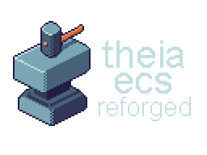

<div align="center">
  
</div>

A **high-performance opinionated ECS** for C# 14 / .NET 10, **written entirely in managed C# with no unsafe code**.

```csharp
World world = new();

Assemblage<Position, Health, Axe> dwarf = world.CreateAssemblage<Position, Health, Axe>();

SettlerQuery<Position, Health, Axe> dwarfQuery = world.CreateSettlerQuery(dwarf);

dwarf.Create(
    new Position() { X = 0, Y = 0 },
    new Health() { Current = 100, Max = 100 },
    new Axe() { Damage = 10, Durability = 100 }
);

ref struct DwarfForEach : IForEach<Position, Health, Axe>
{
    public void Execute(ref Position position, ref Health health, ref Axe axe)
    {
        position.X += 1;
        health.Current -= 1;
        axe.Durability -= 1;
    }
}

DwarfForEach forEach = new();
dwarfQuery.ForEach(ref forEach);
```

## 🔨 Features

- **Archetype-based storage**: **blittable components** stored contiguously in dense arrays, cache-coherent by design;
- **Assemblages**: named entity factories that make composition intent explicit;
- **Bilateral O(1) relations**: tag and evaluated, fully **thread-safe**, with their own event bus and serialization path;
- **Struct callbacks**: zero-allocation, JIT-inlined iteration via `IForEach<T>` and `IForEachEntity<T>`;
- **Parallel execution**: `ForEachParallel`, `ParallelSystems`, and a pooled `JobScheduler` with work-stealing;
- **Deferred commands**: safe structural changes during query and system execution;
- **One-call serialization**: MessagePack-based world save and load, no per-type attributes required;
- **World-level state**: Uniques for mutable world-wide components and Resources for managed asset references.

> Benchmarks: performance results against other ECS frameworks are available in the Theia.Benchmarks project within this repository or via [interactive dashboard](https://wiseshepherdgames.net/Projects/Libraries-and-Frameworks/Theia-ECS/theia-rewrite-benchmark).

## 📜 Documentation

Check out the [**official documentation**](https://wise-shepherd-games.gitbook.io/theia-ecs/)!

## 💾 Installation

Theia ECS Reforged is not available on NuGet. **Clone the repository and reference the project directly.**

If you find a NuGet package named Theia ECS, that is an older, unrelated version and is not this framework.

## 💌 Message from Developer

Hey!

Theia ECS is a project **to develop another passion project**.

It is not supposed to enter into a competitive approach regarding other frameworks.
**It is created to do stuff in a way that I enjoy, and that's it**.

But, since I liked it a lot, I wished to make it public so others can use it too.
Every other framework out there is viable and **made by talented developers**, I highly suggest checking them out.

Thanks again, and I wish you to 🐑 a lot of games with Theia ECS!

## 📕 License

MIT
